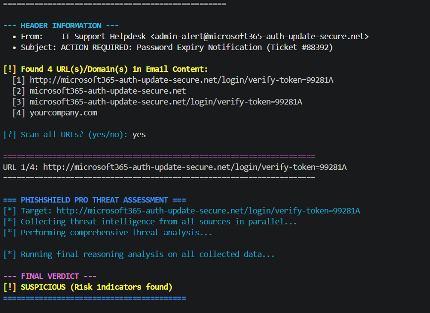
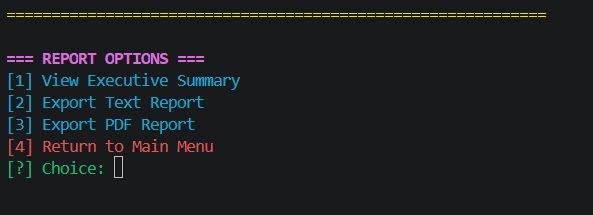

# 🛡️ PhishShield Pro

**Enterprise CLI Phishing Detection and Threat Analysis Suite**

PhishShield Pro is an advanced, terminal-based threat detection tool designed for security operations centers (SOC), incident responders, and cybersecurity researchers. It combines parallel threat intelligence aggregation, dual-AI consensus reasoning, and offline data fallbacks to deliver highly accurate, executive-grade risk assessments.

---

## 📊 Project Previews

### 1. Startup & Health Dashboard

*Initial API health checks, environment validation, and system readiness.*

### 2. Email Header Analysis

*Deep inspection of email headers to detect spoofing and malicious origins.*

### 3. Executive Threat Report Generation

*Automated generation of PDF and TXT reports with AI-driven contextual reasoning.*

### 4. Reporting Export Options

*Flexible output options for compliance, record-keeping, and SOC ticketing systems.*

---

## ✨ Key Features

- **High-Performance Scanning Core:** Asynchronous architecture built with `asyncio` and `httpx` for rapid, concurrent threat intelligence querying.
- **Dual-AI Consensus Pipeline:** Leverages high-throughput and high-accuracy LLMs for deep contextual analysis and zero-day threat detection.
- **Intelligence-Driven Risk Analysis:** Safely handles "unknown" domains; lack of intelligence is flagged as a potential risk rather than automatic safety.
- **Enterprise-Grade False Positive Mitigation:** Built-in whitelisting for trusted enterprise domains to preserve API quotas and reduce noise.
- **Offline Failover Engine:** Maintains defensive capabilities using curated offline datasets when external APIs are rate-limited or unavailable.
- **Executive-Grade Reporting:** One-click generation of professional PDF and TXT assessments containing root-cause analysis and remediation steps.

---

## 🏗️ Architecture Workflow (4-Layer Defense)

1. **Policy & Normalization Layer:** Sanitizes inputs, extracts base domains, and evaluates against strict whitelist policies.
2. **Concurrent Intel Collection:** Orchestrates simultaneous queries across global threat intelligence feeds, IP reputation databases, and WHOIS registries.
3. **AI Reasoning Engine:** Feeds aggregated raw data to LLMs to generate human-readable, SOC-style reasoning.
4. **Verdict & Reporting Layer:** Fuses signals into a final risk score and exports structured compliance reports.

---

## 🚀 Installation & Setup

### Prerequisites
- Python 3.10 or higher
- Valid API keys for AI models and supported threat intel providers

### Step-by-Step Guide

1. **Clone the repository:**

```bash
git clone https://github.com/ayushkp930/PhishShield-Pro.git
cd PhishShield-Pro
```

2. **Set up virtual environment:**

```bash
python -m venv .venv
# On Windows:
.\.venv\Scripts\Activate.ps1
# On Linux/Mac:
source .venv/bin/activate
```

3. **Install dependencies:**

```bash
pip install -r requirements.txt
```

4. **Extract offline datasets (crucial step):**
- Unzip `email_datasets.zip` into `email_datasets.csv`
- Unzip `phishing_site_urls.zip` into `phishing_site_urls.csv`

5. **Configure environment variables:**

```bash
copy .env.example .env
```

Edit `.env` and securely add your API keys. Never commit this file to GitHub.

---

## 📖 User Manual (Usage Guide)

Launch the interactive CLI dashboard using the batch script or Python directly.

### Method 1: Quick Start (Windows)

```bash
.\start_phishshield.bat
```

### Method 2: Manual Python Execution

```bash
python detector.py
```

### Navigating the Tool

1. Select input type: URL, Domain, or Email Header.
2. Enter target data.
3. Wait for parallel execution across APIs and local CSV datasets.
4. Review AI verdict and SOC-style reasoning in terminal output.
5. Export report as PDF or TXT in the output directory.

---

## 🛠️ Troubleshooting (Common Errors)

| Error Message | Cause | Solution |
| --- | --- | --- |
| `FileNotFoundError: [Errno 2] No such file or directory: 'phishing_site_urls.csv'` | Dataset still in `.zip` format | Unzip `phishing_site_urls.zip` and `email_datasets.zip` directly into the project root |
| `API Rate Limit Exceeded (HTTP 429)` | API free-tier quota exhausted | Wait for quota reset or rely on offline CSV fallback mode |
| `pydantic_core._pydantic_core.ValidationError` | Missing or invalid API keys | Verify `.env` matches `.env.example` and keys are valid |

---

## 💻 Tech Stack

- **Core:** Python 3.10+, `asyncio`, `httpx`
- **CLI UX:** `colorama`
- **Reporting:** `fpdf`
- **AI Orchestration:** High-performance global LLMs
- **Threat Intelligence:** Multi-source enterprise reputation API ecosystem and offline datasets

---

## 🔒 Security Notes

- Never upload your real `.env` file to public repositories.
- Use `.env.example` as a template.
- If you accidentally commit a key, rotate/revoke it immediately via the provider dashboard.

---

## ⚖️ Disclaimer

This tool is provided for educational, research, and defensive security purposes only. Users are solely responsible for complying with all applicable laws, platform terms of service, and organizational policies. The authors assume no liability for misuse, unauthorized scanning activity, or system disruptions.
