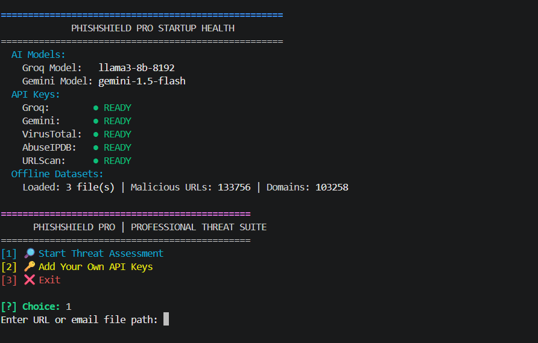
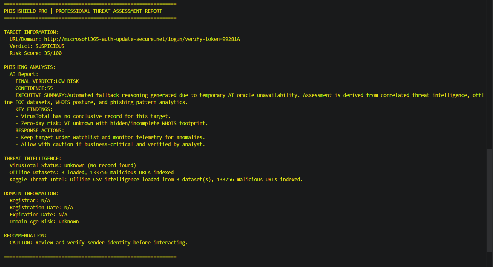

# 🛡️ PhishShield Pro

**Enterprise CLI Phishing Detection and Threat Analysis Suite**

PhishShield Pro is an advanced, terminal-based threat detection tool designed for security operations centers (SOC), incident responders, and cybersecurity researchers. It combines parallel threat intelligence aggregation, dual-AI consensus reasoning, and offline data fallbacks to deliver highly accurate, executive-grade risk assessments.

---

## 📊 Project Previews

### Startup & Health Dashboard

*Initial API health checks, environment validation, and system readiness.*

### Executive Threat Report Generation

*Automated generation of PDF and TXT reports with AI-driven contextual reasoning.*

*(Note: Additional screenshots like Email Header Analysis and Export Options can be found in the `tool_screenshots` directory).*

---

## ✨ Key Features

- **High-Performance Scanning Core:** Asynchronous architecture built with `asyncio` and `httpx` for rapid, concurrent threat intelligence querying.
- **Dual-AI Consensus Pipeline:** Leverages high-throughput and high-accuracy LLMs for deep contextual analysis and zero-day threat detection.
- **Intelligence-Driven Risk Analysis:** Safely handles "unknown" domains; lack of intelligence is flagged as a potential risk rather than automatic safety.
- **Enterprise-Grade False Positive Mitigation:** Built-in whitelisting for trusted enterprise domains to preserve API quotas and reduce noise.
- **Offline Failover Engine:** Maintains defensive capabilities using curated offline datasets when external APIs are rate-limited or unavailable.
- **Executive-Grade Reporting:** One-click generation of professional PDF and TXT assessments containing root-cause analysis and remediation steps.

---

## 🏗️ Architecture Workflow (4-Layer Defense)

1. **Policy & Normalization Layer:** Sanitizes inputs, extracts base domains, and evaluates against strict whitelist policies.
2. **Concurrent Intel Collection:** Orchestrates simultaneous queries across global threat intelligence feeds, IP reputation databases, and WHOIS registries.
3. **AI Reasoning Engine:** Feeds aggregated raw data to LLMs to generate human-readable, SOC-style reasoning.
4. **Verdict & Reporting Layer:** Fuses signals into a final risk score and exports structured compliance reports.

---

## 🚀 Installation & Setup

### Prerequisites
- Python 3.10 or higher
- Valid API keys for AI models and supported Threat Intel providers.

### Step-by-Step Guide

1. **Clone the Repository:**
   ```bash
  [ git clone <your-repo-url>
   cd PhishShield-Pro](https://github.com/ayushkp930/PhishShield-Pro.git)

2. **Set Up Virtual Environment:**
 python -m venv .venv
# On Windows:
.\.venv\Scripts\Activate.ps1
# On Linux/Mac:
source .venv/bin/activate

3. **Install Dependencies:**
   pip install -r requirements.txt

4. Extract Offline Datasets (Crucial Step):
Extract the provided zip files into the root directory of the project to enable offline fallback analysis.

Unzip email_datasets.zip -> email_datasets.csv

Unzip phishing_site_urls.zip -> phishing_site_urls.csv

5. **Configure Environment Variables:**
   copy .env.example .env
   # Edit the .env file and securely add your API keys. Never commit this file.

**User Manual (Usage Guide)**
Launch the interactive CLI dashboard using the provided batch script or Python directly:

**Method 1: Quick Start (Windows)**
.\start_phishshield.bat
**Method 2: Manual Python Execution**
python detector.py

**Navigating the Tool:**
1. Select Input Type: Choose whether you are scanning a URL, Domain, or analyzing an Email Header.

2. Enter Target: Provide the suspect URL or data.

3. Wait for Parallel Execution: The engine will query APIs and local CSVs simultaneously.

4. Review AI Verdict: Read the generated SOC reasoning directly in the terminal.

5. Export Report: Choose to save the findings as a PDF or TXT file in the output directory.

**Error Message,Cause,Solution**
FileNotFoundError: [Errno 2] No such file or directory: 'phishing_site_urls.csv',The dataset is still in .zip format.,Unzip phishing_site_urls.zip and email_datasets.zip directly into the project root folder.
API Rate Limit Exceeded (HTTP 429),You have exhausted the free tier limits of your API providers.,Wait for the quota to reset or rely on the tool's offline CSV fallback mode.
pydantic_core._pydantic_core.ValidationError,Missing or invalid API keys.,Verify your .env file matches the structure of .env.example and keys are correct.

**💻 Tech Stack**
Core: Python 3.10+, asyncio, httpx

CLI UX: colorama

Reporting: fpdf

AI Orchestration: High-Performance Global LLMs

Threat Intelligence: Multi-source enterprise reputation API ecosystem & offline datasets.

**🔒 Security Notes**
Never upload your real .env file to public repositories.

Use .env.example as a template.

If you accidentally commit a key, rotate/revoke it immediately via the provider's dashboard.

**⚖️ Disclaimer**
This tool is provided for educational, research, and defensive security purposes only. Users are solely responsible for complying with all applicable laws, platform terms of service, and organizational policies. The authors assume no liability for misuse, unauthorized scanning activity, or system disruptions.
